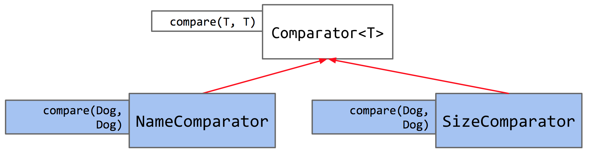

# Subtype Polymorphism vs Higher-Order Functions
*Most of the notes are come from cs61b sp21.*


```java
// Example of subtype polymorphism in Java
import java.util.Comparator;

public class Dog implements Comparable<Dog> {
    ...
    public int compareTo(Dog uddaDog) {
        return this.size - uddaDog.size;
    }

    private static class NameComparator implements Comparator<Dog> {
        public int compare(Dog a, Dog b) {
            return a.name.compareTo(b.name);
        }
    }

    public static Comparator<Dog> getNameComparator() {
        return new NameComparator();
    }
}
```

```
Comparator<Dog> nc = Dog.getNameComparator();
```
- Some explanations:
  1. Many class defined by java may already be **comparable**, this way we implement the `Comparable` interface(just like String). 
  2. We can use `Comparator` as a container. This can also make whole program logical and resonable.
