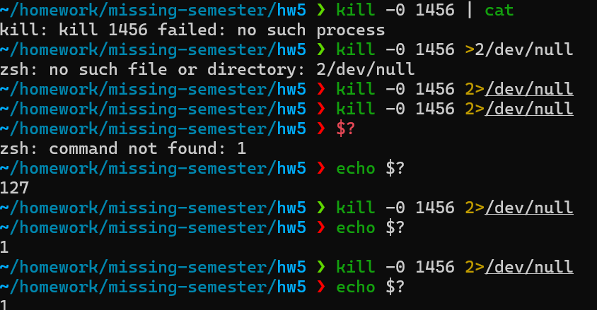

### What `$?` actually is

`$?` is **not output from the last command**.
It’s a **shell variable** that the shell sets internally after each command finishes.

* When you just type `$?` at the prompt, your shell tries to *expand* it immediately. But since the shell expects a command, not a bare number, you usually get an error or confusing behavior.
* When you do `echo $?`, you’re telling the shell: *run `echo`, but before running it, replace `$?` with the stored exit code of the previous command.* That’s why you see the number printed.

---

### Why `echo $?` shows the right number

Flow of events:

1. You run a command (say `kill -0 1234`). It finishes with exit code `1`.
2. The shell sets `$?=1` internally.
3. Then you type `echo $?`. Before `echo` runs, the shell expands `$?` → `1`.
4. What actually executes is `echo 1`.
5. So you see `1` printed.

---

### Why `$?` alone doesn’t work

If you just type `$?` at the prompt, the shell does variable expansion first → becomes `1`. Then the shell tries to run a command literally called `1`, which doesn’t exist. That’s why it fails.

That failure also **overwrites** `$?` with a new exit code (usually `127` = “command not found”). So by the time you look again, the value is gone.

---

### How redirection fits in

Redirection (`1>`, `2>`, etc.) only deals with **streams**:

* `1` = stdout (normal output)
* `2` = stderr (error output)

But `$?` doesn’t live in a stream. It lives in the shell’s internal state. That’s why you can’t capture it with `1>` or `2>`. You only access it directly as a variable.

---

### Mental model

* `>` redirects *what a program writes*.
* `$?` reflects *how a program ended*.

They’re completely different channels of information.

---

Forward-thinking tip: This “status vs output” distinction is fundamental in shell scripting. Get comfortable with `$?` for success/failure logic, and stdout/stderr redirection for data handling. When building robust scripts, check exit codes first, then parse output only if needed.

Want me to show you a tiny demo that clearly shows the three separate worlds: stdout, stderr, and `$?` all at once?

##### `Tldr: 
---

---
Relevant Link: [[Shell]] [[Linux]] 
Date: 2025-09-23 
Time: 20:55