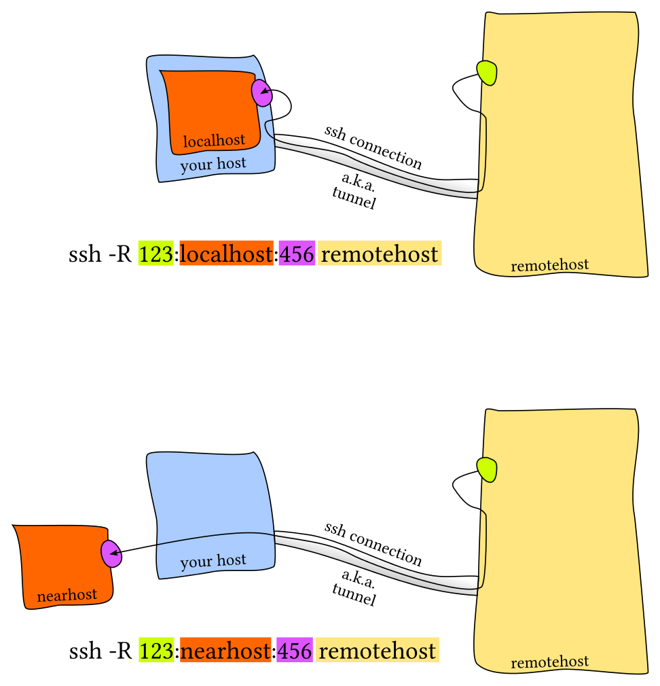

This snippet is from [missing-semester](https://missing.csail.mit.edu/2020/command-line/)
# Remote Machines

It has become more and more common for programmers to use remote servers in their everyday work. If you need to use remote servers in order to deploy backend software or you need a server with higher computational capabilities, you will end up using a Secure Shell (SSH). As with most tools covered, SSH is highly configurable so it is worth learning about it.

To `ssh` into a server you execute a command as follows

```bash
ssh foo@bar.mit.edu
```

Here we are trying to ssh as user `foo` in server `bar.mit.edu`.
The server can be specified with a URL (like `bar.mit.edu`) or an IP (something like `foobar@192.168.1.42`). Later we will see that if we modify ssh config file you can access just using something like `ssh bar`.

## Executing commands

An often overlooked feature of `ssh` is the ability to run commands directly.
`ssh foobar@server ls` will execute `ls` in the home folder of foobar.
It works with pipes, so `ssh foobar@server ls | grep PATTERN` will grep locally the remote output of `ls` and `ls | ssh foobar@server grep PATTERN` will grep remotely the local output of `ls`.


## SSH Keys

Key-based authentication exploits public-key cryptography to prove to the server that the client owns the secret private key without revealing the key. This way you do not need to reenter your password every time. Nevertheless, the private key (often `~/.ssh/id_rsa` and more recently `~/.ssh/id_ed25519`) is effectively your password, so treat it like so.

### Key generation

To generate a pair you can run [`ssh-keygen`](https://www.man7.org/linux/man-pages/man1/ssh-keygen.1.html).
```bash
ssh-keygen -a 100 -t ed25519 -f ~/.ssh/id_ed25519
```
You should choose a passphrase, to avoid someone who gets hold of your private key to access authorized servers. Use [`ssh-agent`](https://www.man7.org/linux/man-pages/man1/ssh-agent.1.html) or [`gpg-agent`](https://linux.die.net/man/1/gpg-agent) so you do not have to type your passphrase every time.

If you have ever configured pushing to GitHub using SSH keys, then you have probably done the steps outlined [here](https://help.github.com/articles/connecting-to-github-with-ssh/) and have a valid key pair already. To check if you have a passphrase and validate it you can run `ssh-keygen -y -f /path/to/key`.

Find more: [Ssh With Git](../../Git/RemoteCommands.md)

### Key based authentication

`ssh` will look into `.ssh/authorized_keys` to determine which clients it should let in. To copy a public key over you can use:

```bash
cat .ssh/id_ed25519.pub | ssh foobar@remote 'cat >> ~/.ssh/authorized_keys'
```

A simpler solution can be achieved with `ssh-copy-id` where available:

```bash
ssh-copy-id -i .ssh/id_ed25519 foobar@remote
```

## Copying files over SSH

There are many ways to copy files over ssh:

- `ssh+tee`, the simplest is to use `ssh` command execution and STDIN input by doing `cat localfile | ssh remote_server tee serverfile`. Recall that [`tee`](https://www.man7.org/linux/man-pages/man1/tee.1.html) writes the output from STDIN into a file.
- [`scp`](https://www.man7.org/linux/man-pages/man1/scp.1.html) when copying large amounts of files/directories, the secure copy `scp` command is more convenient since it can easily recurse over paths. The syntax is `scp path/to/local_file remote_host:path/to/remote_file`
- [`rsync`](https://www.man7.org/linux/man-pages/man1/rsync.1.html) improves upon `scp` by detecting identical files in local and remote, and preventing copying them again. It also provides more fine grained control over symlinks, permissions and has extra features like the `--partial` flag that can resume from a previously interrupted copy. `rsync` has a similar syntax to `scp`.

## Port Forwarding

In many scenarios you will run into software that listens to specific ports in the machine. When this happens in your local machine you can type `localhost:PORT` or `127.0.0.1:PORT`, but what do you do with a remote server that does not have its ports directly available through the network/internet?.

This is called _port forwarding_ and it
comes in two flavors: Local Port Forwarding and Remote Port Forwarding (see the pictures for more details, credit of the pictures from [this StackOverflow post](https://unix.stackexchange.com/questions/115897/whats-ssh-port-forwarding-and-whats-the-difference-between-ssh-local-and-remot)).

**Local Port Forwarding**


**Remote Port Forwarding**


The most common scenario is local port forwarding, where a service in the remote machine listens in a port and you want to link a port in your local machine to forward to the remote port. For example, if we execute  `jupyter notebook` in the remote server that listens to the port `8888`. Thus, to forward that to the local port `9999`, we would do `ssh -L 9999:localhost:8888 foobar@remote_server` and then navigate to `localhost:9999` in our local machine.


## SSH Configuration

We have covered many many arguments that we can pass. A tempting alternative is to create shell aliases that look like
```bash
alias my_server="ssh -i ~/.id_ed25519 --port 2222 -L 9999:localhost:8888 foobar@remote_server"
```

However, there is a better alternative using `~/.ssh/config`.

```bash
Host vm
    User foobar
    HostName 172.16.174.141
    Port 2222
    IdentityFile ~/.ssh/id_ed25519
    LocalForward 9999 localhost:8888

# Configs can also take wildcards
Host *.mit.edu
    User foobaz
```

An additional advantage of using the `~/.ssh/config` file over aliases  is that other programs like `scp`, `rsync`, `mosh`, &c are able to read it as well and convert the settings into the corresponding flags.


Note that the `~/.ssh/config` file can be considered a dotfile, and in general it is fine for it to be included with the rest of your dotfiles. However, if you make it public, think about the information that you are potentially providing strangers on the internet: addresses of your servers, users, open ports, &c. This may facilitate some types of attacks so be thoughtful about sharing your SSH configuration.

Server side configuration is usually specified in `/etc/ssh/sshd_config`. Here you can make changes like disabling password authentication, changing ssh ports, enabling X11 forwarding, &c. You can specify config settings on a per user basis.

## Miscellaneous

A common pain when connecting to a remote server are disconnections due to your computer shutting down, going to sleep, or changing networks. Moreover if one has a connection with significant lag using ssh can become quite frustrating. [Mosh](https://mosh.org/), the mobile shell, improves upon ssh, allowing roaming connections, intermittent connectivity and providing intelligent local echo.

Sometimes it is convenient to mount a remote folder. [sshfs](https://github.com/libfuse/sshfs) can mount a folder on a remote server
locally, and then you can use a local editor.

---

## Ssh-agent
When you have multiple SSH keys, typing the passphrase for each key every time you use it can become tedious. This is where `ssh-agent` comes in handy. It is a program that holds your private keys in memory and provides them to `ssh` when needed, so you only have to enter your passphrase once per session.

You’re asking what these two commands do:

```bash
eval "$(ssh-agent -s)"
ssh-add ~/.ssh/id_ed25519
```

Let’s unpack them carefully.

---

### 1. `eval "$(ssh-agent -s)"`

* `ssh-agent` is a background program that holds your **private SSH keys** in memory.
  This way, you don’t have to type your passphrase every single time you use the key.
* `-s` tells it to output shell commands that set up environment variables (like `SSH_AUTH_SOCK` and `SSH_AGENT_PID`) so your current shell knows how to talk to the agent.
* `eval` executes those shell commands in your current session.

So, this line **starts an ssh-agent process and connects your shell to it.**

---

### 2. `ssh-add ~/.ssh/id_ed25519`

* `ssh-add` is used to add a private key to the running `ssh-agent`.
* `~/.ssh/id_ed25519` is the default private key file you generated with `ssh-keygen`.

When you run this:

* If your private key has a passphrase, it will ask you for it once.
* After that, the agent keeps the decrypted key in memory, and you don’t have to retype the passphrase every time you push/pull to GitHub.

---

### Analogy

Think of `ssh-agent` as a **keychain manager**:

* `ssh-agent` = the keychain.
* `ssh-add` = putting your house key into the keychain.
* Once added, every program (like `git`) can ask the keychain for the key, instead of you fishing it out and typing the password again.

---

⚡ Forward-thinking tip: In WSL2, it’s often useful to set up your `~/.bashrc` or `~/.zshrc` so it auto-starts `ssh-agent` and adds your key when you open a shell. That way, you never forget to do it and your git workflow stays smooth.

Do you want me to show you how to automate this so you don’t have to run those two commands manually every time?

Good — so the parsing error is fixed, but now you say it’s **still stuck** when you run

```
ssh -T git@github.com
```

Let’s reason this out.

When SSH hangs instead of giving an immediate success/error, it usually means:

1. **Firewall/Network issue** — port 22 to GitHub is blocked. Some networks (corporate, school, certain ISPs) block SSH on port 22.

   * GitHub provides an alternate port 443 endpoint for this:

     ```bash
     ssh -T -p 443 git@ssh.github.com
     ```

2. **SSH key not being used** — if your config isn’t pointing to the right key, SSH may keep trying with the wrong credentials before timing out.

   * Your config shows:

     ```ssh
     Host github.com
       HostName github.com
       User potaxo
       IdentityFile ~/.ssh/github_globle
       AddKeysToAgent yes
     ```

     Two issues here:

     * The `User` should be **git**, not your username. GitHub *only* accepts `git` as the SSH user.
     * The filename `github_globle` looks suspicious — maybe you meant `github_global`? If the file doesn’t exist, SSH won’t find a key.

   Corrected block should be:

   ```ssh
   Host github.com
     HostName github.com
     User git
     IdentityFile ~/.ssh/github_global
     AddKeysToAgent yes
   ```

3. **SSH agent not running / key not added** — Even if the key exists, you might need to add it:

   ```bash
   ssh-add ~/.ssh/github_global
   ```

---

### Step-by-step to debug

Run each in order:

1. **Verbose test**

   ```bash
   ssh -vT git@github.com
   ```

   This prints what keys SSH is trying and where it gets stuck.

2. **Check key existence**

   ```bash
   ls -l ~/.ssh/
   ```

   Confirm the actual filename (fix typo if needed).

3. **Add key to agent**

   ```bash
   eval "$(ssh-agent -s)"
   ssh-add ~/.ssh/github_global
   ```

4. **Retry with alternate port**

   ```bash
   ssh -T -p 443 git@ssh.github.com
   ```

---

⚡ Forward-thinking tip: Always keep your SSH config “GitHub-clean”:

* `User git`
* Correct `IdentityFile` path
* Use `ssh -vT` for debugging (verbosity is your microscope into SSH).

Do you want me to walk you through interpreting the `ssh -vT` output so you can see *exactly* where it’s hanging?

