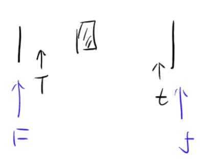

# UsefulVimCommands

## The difference between :q! and :!q :
- :q! is used to quit Vim without saving changes
- :!q try to run an external command.
---

## Subsitude command:
- :%s/old/new/g replaces all occurrences of 'old' with 'new' in the entire file
- :%s/old/new/gc replaces all occurrences of 'old' with 'new' in the entire file and asks for confirmation before each replacement

### Example:
```vim
:%s/\v<(t|tUp|tRight)\>/&.value/g)>
```
#### Explanation:
- `\v` enables very magic mode, which makes the regex more concise
- `<(t|tUp|tRight)>` matches the words 't', 'tUp', or 'tRight' as whole words
- `&.value` replaces the matched words with themselves followed by '.value'
- `%` applies the substitution to the entire file

### Substitution with visual selection:
1. Select the text you want to replace using visual mode (v or V)
2. Press `:` to enter command mode, which will automatically prepend `:'<,'>` to the command
3. Type `s/old/new/g` to replace 'old' with 'new' in the selected text

---

## Delete all lines containing a specific word:
- `:g/word/d` deletes all lines containing 'word'
> **Explanation**:  
> `:g` is a global command that applies to all lines in the file    
> `/word/` is a pattern that matches lines containing 'word'    
> `d` is the command to delete the matching lines   

---

## Buffer, tabs, and windows:
Vim maintains a set of open files, called "buffers". A vim session has a number of tabs, each of which has a number of windows. Each window displays a buffer (not 1 to 1 mapping).
### Some useful commands:
- `ctrl-w` - Window commands:
  - `ctrl-w s` or `:sp` - Split window horizontally
  - `ctrl-w v` or `:vsp` - Split window vertically
  - `ctrl-w q` - Close the current window
  - `ctrl-w w` - Switch to the next window
  - `ctrl-w h/j/k/l` - Move to the left/down/up/right window
- `:ls` or `:buffers` - List all open buffers
  - `:b <buffer_number>` - Switch to a specific buffer
  - `:bd <buffer_number>` - Delete a specific buffer
  - `:bn` - Switch to the next buffer
  - `:bp` - Switch to the previous buffer
  - `:bf` - Switch to the first buffer
  - `:bl` - Switch to the last buffer 

---

  ## Open help
- `help {topic}` - Open help for a specific topic
  ### Example
```vim
:help :w #open help for the :w command
:help w #open help for the w command
```

---

## Movement
(This part is mostly come from https://missing.csail.mit.edu/2020/editors/ and made some modification)

- **Words**: w (next word), b (beginning of word), e (end of word)
- **Lines**: 0 (beginning of line), ^ (first non-blank character), $ (end of line)
- **Screen**: H (top of screen), M (middle of screen), L (bottom of screen)
- **Scroll**: Ctrl-u (up), Ctrl-d (down)
- **File**: gg (beginning of file), G (end of file)
  - `Ctrl-G` to show current line number and total number of lines
- **Line numbers**: :`{number}<CR>` (carriage return usually be enter(can find more detail via `:help key-notation`)) or `{number}G` (line {number})
- **Misc**: % (corresponding item)
- **Find**: f{character}, t{character}, F{character}, T{character}
  - find/to forward/backward {character} on the current line
  - , / ; for navigating matches
  >Example:
  > search||(cursor is here) write code
  > `fe` equal to `e`
  > `to` equal to `c` 
  > `Fe` equal to `e`
  > `Ta` equal to `r`
  
- **Search**: /{regex}, n / N for navigating matches
  - `Ctrl-o` (back in search history) 
  - `Ctrl-i` (forward in search history)

### Some useful settings:
- `:set number` - Show line numbers
- `:set ic` - Ignore case in search
- `:set hls is` - Highlight search results and incsearch
- `:set nohls` - Turn off search highlighting
- `:set noic` - Turn off ignore case in search

---